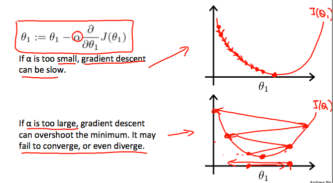

# Parameter Learning - Gradient Descent

- The goal of **gradient descent** is to estimate the most optimal parameters for our hypothesis function such that it would produce the minimum value for the cost minimum

- Given, a hypothesis function with two parameters $\theta_0$ and $\theta_1$, we can create a contour plot to visual the cost function where we put $\theta_0$ on the $x$ axis, $\theta_1$ on the $y$ axis, value of the cost function on the vertical $z$ axis

  The points on our graph will be the result of the cost function using our hypothesis with those specific theta parameters. The graph below depicts such a setup.

  We will know the optimal $\theta_0$ and $\theta_1$when we have reached the bottom of a pit. Shown by the red arrow.

- The following are steps for gradient descent

  1. Select a random point on the cost function to start
  2. Find the derivative(slope of the tangent line) of the given point.
  3. Based on the derivative move select a direction to 'descend'.
     - Step down the cost function in the direction with the steepest descent.
     - The size of each step is denoted by the **learning rate**, $\alpha$

### Learning Rate ( $\alpha$ )

- The distance between each 'star' in the graph above represents a step determined by our parameter $\alpha$.
  
- A smaller $\alpha$ would result in small steps and a larger $\alpha$ would result in larger steps

- The size of the step will also natural become shorter as it nears the minimum value for the cost function and optimal parameters. This is due to the fact that the the derivative of the cost function is factored in to the size of the step.
  

### Gradient Descent Algorithm

1. Repeat the following until convergence

    $\theta_j$ $:=$ $\theta_j$ $- \alpha$ $\frac{\delta}{\delta\theta}J(\theta_0,\theta_1)$

    - $:=$ , this notation representation a variable assignment

2. Where $j=0,1$ representing the feature index numbers

3. After each iteration $j$, all the parameters should be updated simultaneously  
  

### Gradient Descent - Univariate

- Given a hypothesis function with one parameter $\theta_1$, the following is a plot of the cost function with the tangential line, representing a gradient descent.

- When the slope's sign for $\frac{\delta}{\delta\theta}J(\theta_1)$ is...
  - Negative, the value of $\theta_1$ increases
  - Positive, the value of $\theta_1$ decreases

- Regardless of the slope's sign for $\frac{\delta}{\delta\theta}J(\theta_1)$, $\theta_1$ will eventually converge on the minimum value

