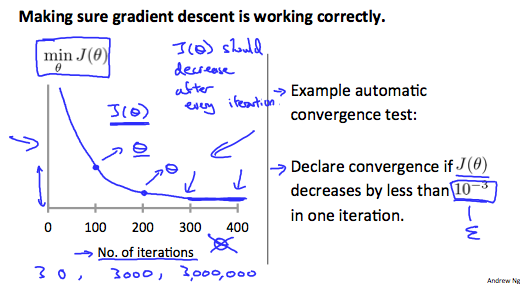

# Multivariate Linear Regression

### Notation

- $m$, the number of training examples in a dataset
- $n$, the number of features or variables
- $x^i_j$, value of feature $j$ in the $i$ training example

To accommodate the multiple feature the multivariate form of a hypothesis looks like..

$$
h_\theta(x)=\theta_0 + \theta_1x_1 + \theta_2x_2 + ... + \theta_nx_n
$$

or using properties of matrix multiplication to provide a more concise representation...

$$
h_\theta(x)=
\begin{bmatrix}
\theta_0 && \theta_1 && \theta_2&& ... && \theta_n
\end{bmatrix}
\begin{bmatrix}
  x_0\\
  x_1\\
  ...\\
  x_n
\end{bmatrix}
=
\theta^T x
$$

### Gradient Descent for Multiple Variables

- Gradient descent for multivariate and univariate linear regression are practically the same

- Difference being that for multivariate linear regression gradient descent formula is repeated until convergence $j$ times for each feature.

Repeat until convergence {
$$\theta_j := \theta_j - \alpha\frac{1}{m}\sum_{i=1}^{m} (h_\theta(x^i) - y^i) x^i_j
$$
} for $j :=0...n$

## Gradient Descent - Feature Scaling & Mean Normalization

- Feature scaling, a method used to speed up computation of gradient descent by converting the input values for features into roughly the same range
  - Feature scaling can be done by dividing the input value by the range(max - min) of the input values or the standard deviation
  - The result will be inputs in a new range of $1$

- Mean Normalization
  - can be done by subtracting the input value by the average of the input values

- Typically feature scaling and mean normalization can be combine as such:
  
  $x_i := \frac{x_i - \mu_i}{s_i}$

  - where,

    $x_i$, is the $i$th input value

    $\mu_i$, is the average of all the input values (mean normalization)

    $s_i$, is the range of input values(max-min) or standard deviation (feature scaling)

- The ideal range for input values are:
  
  $-1 \le x_i \le -1$ or $-0.5 \le x_i \le -0.5$

### Gradient Descent - Learning Rate $(\alpha)$

- Debugging gradient descent, plot cost function, $J(\theta)$, over the number of iterations on the $x$-axis
  - $J(\theta)$ should decrease as the number of iterations increases
  - if $J(\theta)$ increases, then you should decrease $\alpha$
- Automatic convergence test, a test that declares convergence if $J(\theta)$ decreases by less than a really tiny number, $\Epsilon$, such as $10^{-3}$ in one iteration

- To conclude,
  - if $\alpha$ is too small, slow convergence
  - if $\alpha$ is too large, $J(\theta)$ may not decrease on every iteration and thus may not converge

 

### Polynomial Regression & Features

- A hypothesis function can be define as a polynomial if it provides a better fit to the data set

- Features can be combines and manipulates as well to derive a better hypothesis
